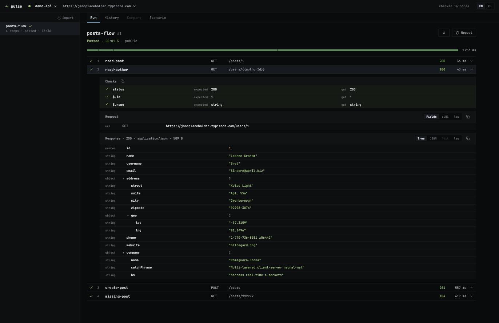

# pulse

Visual e2e runner for HTTP APIs. Agents or humans drop YAML scenarios into a
folder — Pulse picks them up, runs them against your backend and shows every
step live: requests, responses, checks, captured variables, timings.



## Why

Poking a business flow by hand — curl, Postman, Swagger — is slow, and the
result disappears the moment you close the terminal. Pulse turns a flow like
_"sign in, create an order, verify the totals and access rules"_
into a YAML file that runs in seconds and leaves a browsable record: what was
called, with which payload, what came back, which check failed and where the
time went.

Scenarios are written by hand or by a coding agent working from [SPEC.md](SPEC.md) —
the format is deliberately small: linear steps, explicit expectations, variable
capture between steps, retries, a cookie jar and teardown. No branching, no
embedded scripts.

## Features

- **Live runs** — every step streams to the browser as it executes; expected
  negative responses (401 on a burned token) count as passing steps
- **Full step detail** — request parsed / as cURL / raw, response as tree /
  JSON / text / raw, every check with expected vs actual, captured variables
  with their consumers
- **History and diff** — every run is stored; compare two runs step by step
  with durations and deltas
- **Project statistics** — over the last N runs: what slowed down, what fails,
  which steps pass only on a retry, the slowest endpoints, what nobody ran for
  a week
- **MCP server** — a coding agent reads the format, writes a scenario, runs it
  and reads back what failed, without a human relaying files
- **Multiple hosts per project** — run the same scenarios against localhost or
  a stand, switch in the header, add hosts ad hoc
- **Deploy suite** — mark scenarios "Run on deploy" and trigger them from CI
  with a single request; non-zero suite result fails the pipeline
- **Teardown** — `cleanup:` steps run even after a failure and keep test data
  from piling up, strictly through the API
- **Single-account auth** — Postgres-style `PULSE_USER` / `PULSE_PASSWORD`
  env vars; sessions survive restarts; no password — no login screen

## Quick start

```sh
docker run -d --name pulse -p 7100:7100 \
  -v pulse-data:/data \
  --add-host host.docker.internal:host-gateway \
  ghcr.io/kebabovicz/pulse:latest
```

The image is published by CI on every push to `main` (and `vX.Y.Z` git tags).
If the package is still private, `docker login ghcr.io` with a token that has
`read:packages` first. Or build from source:

```sh
docker build -t pulse .
```

Open http://localhost:7100 — the empty state points you to the config.
Describe your project in `/data/projects.yaml`:

```yaml
projects:
  - id: myapi
    name: my-api
    hosts:
      local: http://host.docker.internal:8080
    healthPath: /health
```

Put a scenario into `/data/scenarios/myapi/` (or use the import button):

```yaml
name: smoke
steps:
  - id: health
    request: { method: GET, path: /health }
    expect: { status: 200 }
```

It appears in the sidebar by itself. Press run.

The full scenario format — checks, captures, retries, cookies, cleanup — is in
[SPEC.md](SPEC.md). Configuration, storage layout and the CI endpoint are in
[spec/config.md](spec/config.md).

## Configuration

Everything the container needs is a data volume; the rest is optional.

| variable | default | effect |
| --- | --- | --- |
| `PULSE_PORT` | `7100` | port to listen on |
| `PULSE_DATA_DIR` | `/data` | config, scenarios and run history |
| `PULSE_USER` | — | login; without a password there is no login screen |
| `PULSE_PASSWORD` | — | password, and the bearer token for CI and MCP |
| `LOG_LEVEL` | `info` | log level |
| `PULSE_LOG_STEPS` | — | `1` adds a log record per finished step |
| `PULSE_EVENTS_FILE` | — | append events to a file as JSON Lines |
| `PULSE_EVENTS_URL` | — | POST batches of events to a collector |
| `PULSE_EVENTS_TOKEN` | — | bearer token for that endpoint |

```sh
docker run -d --name pulse -p 7100:7100 \
  -v pulse-data:/data \
  -e PULSE_USER=pulse -e PULSE_PASSWORD=secret \
  -e PULSE_EVENTS_URL=https://collector.example.com/ingest \
  --add-host host.docker.internal:host-gateway \
  ghcr.io/kebabovicz/pulse:latest
```

Timeouts and limits live in `projects.yaml`, next to the projects, because they
belong to the data rather than to the deployment:

```yaml
settings:
  healthInterval: 30s   # how often a host is pinged
  stepTimeout: 10s      # per request; a step may override it
  runTimeout: 5m        # a whole run
  bodyLimit: 256kb      # response body kept in the run record
```

## Writing scenarios with an agent (MCP)

Pulse is an MCP server, so a coding agent can learn the format, write a
scenario, run it and read what failed — without a human passing files around.
Point the agent at the `/mcp` endpoint:

```json
{
  "mcpServers": {
    "pulse": {
      "type": "http",
      "url": "http://localhost:7100/mcp"
    }
  }
}
```

On a stand protected by a password, add the same credentials the UI uses:

```json
{ "headers": { "Authorization": "Bearer <PULSE_PASSWORD>" } }
```

The agent gets these tools:

| tool | what it does |
| --- | --- |
| `spec` | the scenario format and its JSON Schema |
| `projects` | projects, their hosts and scenario folders |
| `scenarios` | what is already written, and how it last ran |
| `read` | the YAML of one scenario |
| `validate` | check a scenario against the schema without saving |
| `write` | save a scenario — only if it passes the schema |
| `run` | run it and get the outcome per step |
| `result` | the outcome of an earlier run |
| `step` | full request and response of one step |

Run summaries are deliberately compact — bodies are cut and only failed checks
are spelled out, so a debugging loop does not burn the agent's context. The full
body of a step comes from `step` when the summary is not enough.

## Logs and events

Every run leaves a structured record on stdout — one JSON line per event, flat
keys, no nesting to unwrap:

```json
{"event":"run.finished","ts":"2026-08-27T09:12:04.881Z","project":"myapi",
 "scenario":"auth/otp-login.yaml","run":42,"status":"failed","durationMs":2311,
 "failedStep":"verify-code","failedCheck":{"expected":"200","actual":"401"}}
```

That is what promtail, alloy, fluent-bit and the rest already ingest, so a
Grafana dashboard or an alert on `status="failed"` needs no exporter of its own.

Events: `run.started`, `run.finished`, `step.finished`, `scenario.changed`,
`health.changed`. Step records are off by default (`PULSE_LOG_STEPS=1`).

The same records can go to a file (`PULSE_EVENTS_FILE`) or to a collector
(`PULSE_EVENTS_URL`) in batches — every 50 records or two seconds, and once more
when the container stops. A collector that is down is logged and skipped:
telemetry never stalls a run.

## CI integration

Mark scenarios as "Run on deploy" in the UI, then call from your pipeline after
a deploy:

```sh
curl --fail-with-body -sS -X POST \
  -H "Authorization: Bearer $PULSE_PASSWORD" \
  -H "content-type: application/json" \
  -d '{"host":"stand"}' \
  https://pulse.example.com/api/projects/myapi/ci/run
```

200 — all scenarios passed; 422 — the body tells you which scenario and step
failed, and the run is waiting in the Pulse history with full detail.

## Development

```sh
npm install
npm run dev     # server :7100 + vite dev server :5173 with /api proxy
npm run build   # shared types, server, web bundle
```

Monorepo: `packages/shared` (types + scenario JSON Schema), `packages/server`
(Fastify, runner, SSE), `packages/web` (React + Vite). Local dev config lives
in `.local/data/projects.yaml`.

---

Author: [kebabovicz](https://github.com/kebabovicz)
